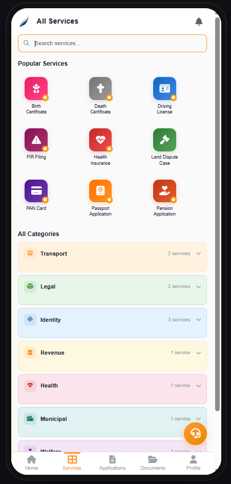
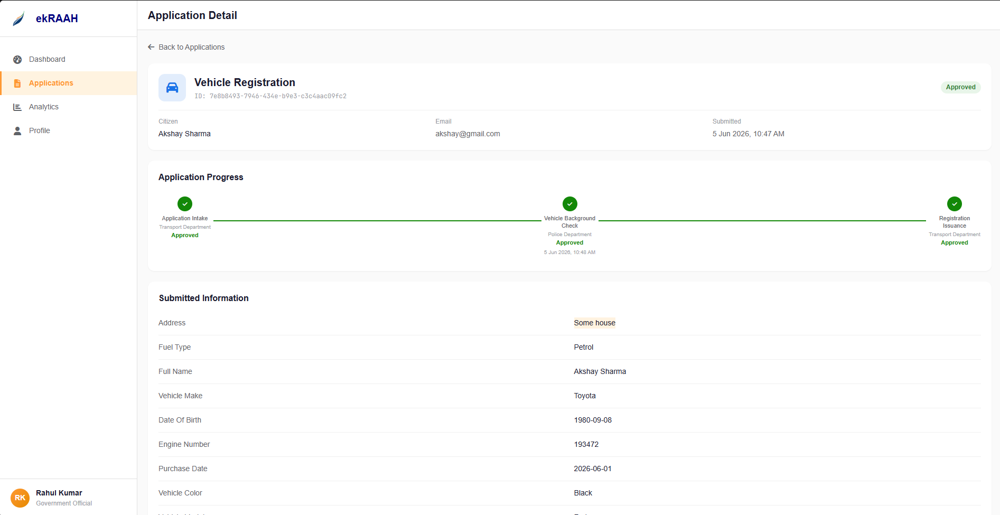

# ekRAAH

A proposed unified interface for government services, both for citizens and government officials.

## Live Demo

[Visit Website](https://rishitc17.github.io/ekRAAH)

## Overview

ekRAAH was created as part of our team project for the 1 Million Founders program. The ideology behind this app is to unify fragmented government services in India under one platform and one UI. We also aim to simplify the transfer of applications between government departments.

## Features

- Unified interface for citizens
- Automatic transfer of cases between government departments
- Consistent, modern UI

## Technologies

- HTML
- CSS
- JavaScript
- Supabase

## Screenshots

### Citizen Interface

### Government Interface

## Future Improvements

- Re-scope for feasibility
- Collaborate with the government via government-initiated innovation challenges

## Status

Prototype
